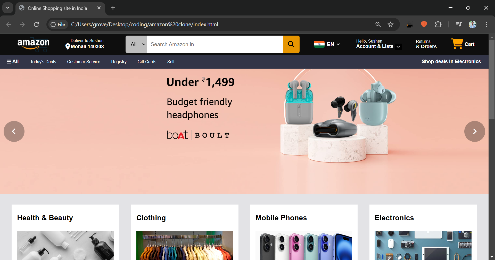
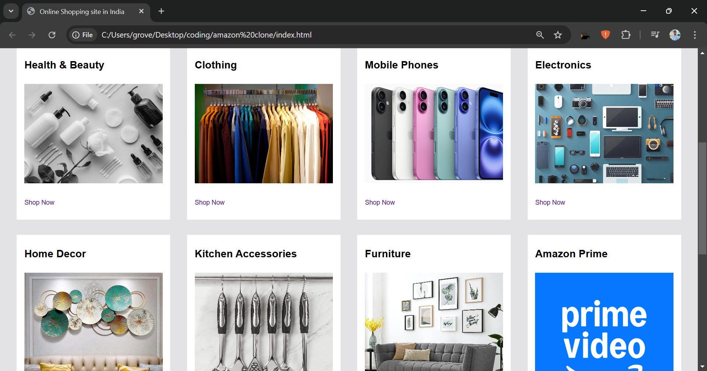
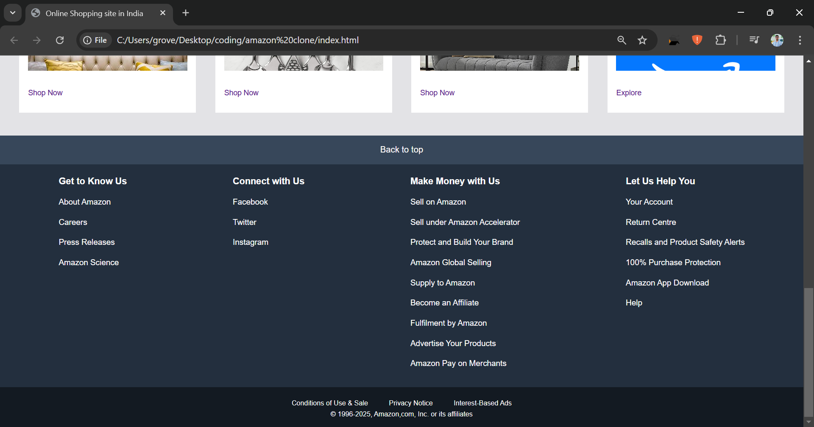

# Amazon-Clone-Project
A clone of the Amazon homepage built using HTML and CSS. This project replicates the layout, styling, and basic structure of Amazon's homepage to practice front-end web development skills.

<h3>🛠️ Technologies Used</h3>
<ul>
  <li>HTML for structuring the webpage</li>
  <li>CSS for styling and layout</li>
</ul>

<h3>How to Use?</h3>
<ul>
  <li>Download the zip file.</li>
  <li>Extract it.</li>
  <li>Run the index.html file in your browser.</li>  
</ul>

<h3>Screenshots</h3>

<h3>🚀 My First GitHub Project! 🚀</h3>
This is the first-ever project I pushed to GitHub! 🎉 Built with HTML & CSS, this Amazon homepage clone marks the beginning of my web development journey. 
 
Thanks for checking it out! 🙂
